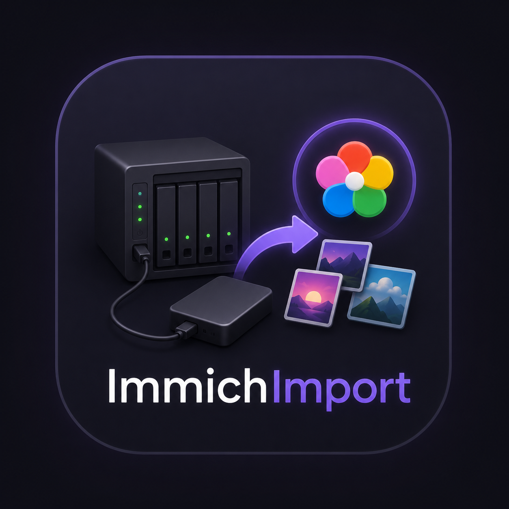
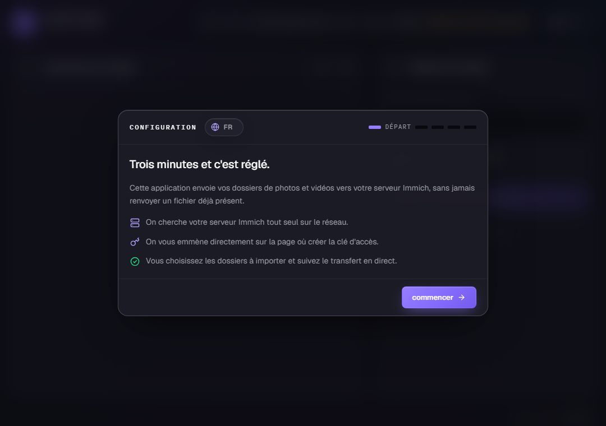
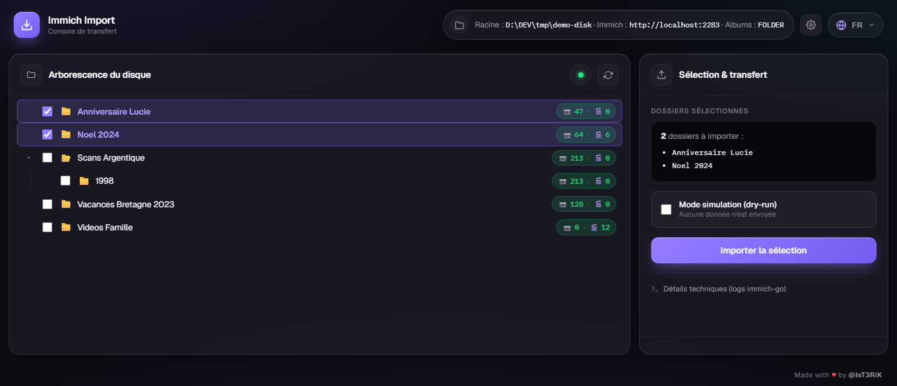
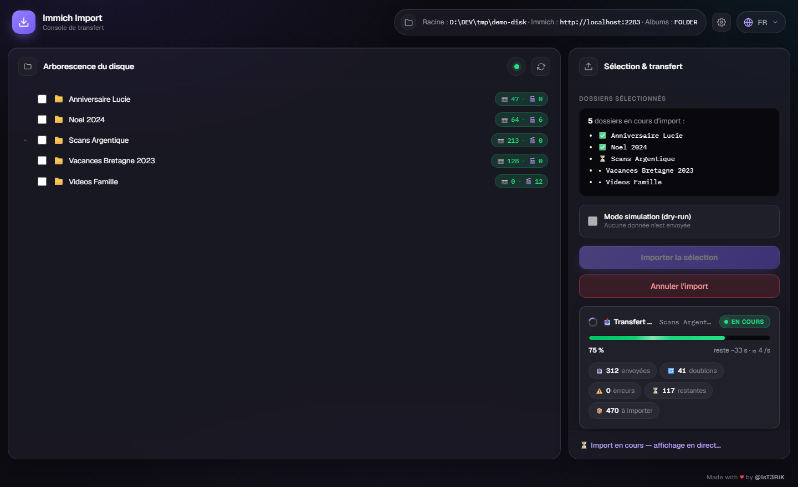
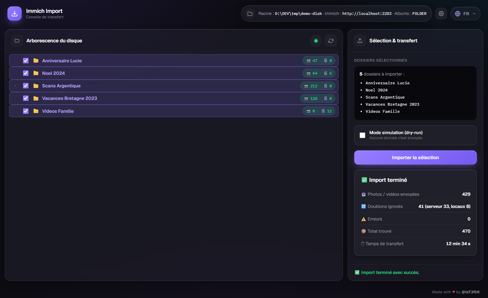
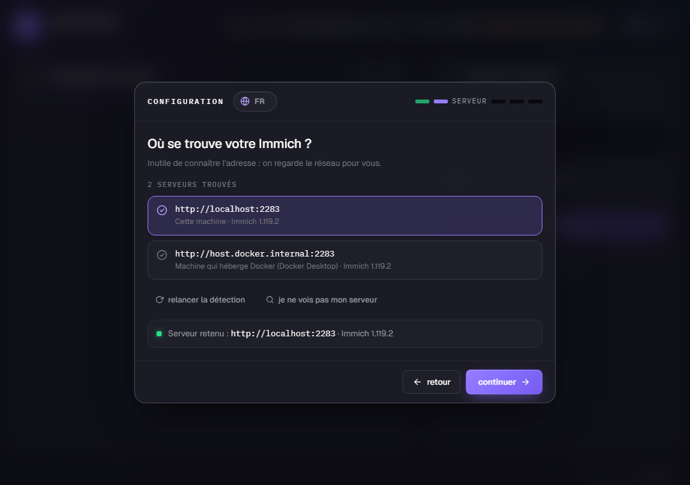
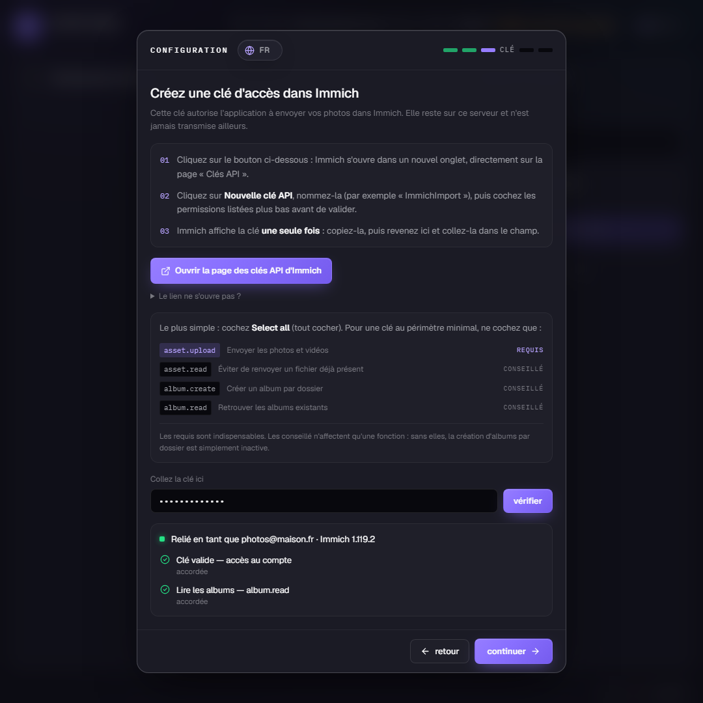
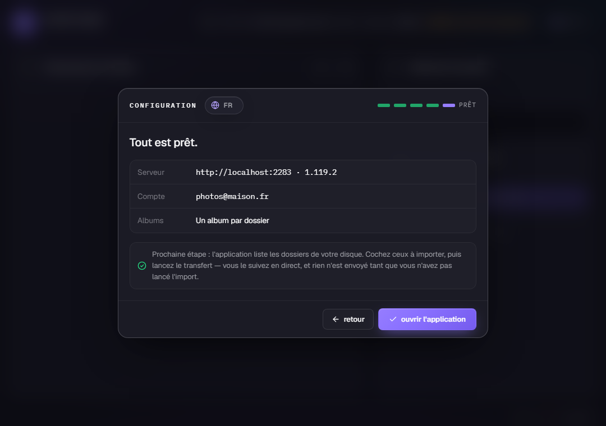

<p align="center">
  
</p>

<h1 align="center">Immich Import</h1>

<p align="center"><strong>Vider un disque externe dans Immich, sans se tromper.</strong></p>

Vous branchez un disque USB sur le NAS, vous cochez les dossiers à envoyer, vous
cliquez. L'application s'occupe du reste et vous montre le transfert en direct.

Pas de ligne de commande, pas de fichier de configuration à écrire : au premier
lancement, un **assistant** trouve votre serveur Immich tout seul et vous guide
pour créer la clé d'accès.

## Aperçu

<table>
  <tr>
    <td width="50%"><br><em>1. Un assistant vous configure l'app</em></td>
    <td width="50%"><br><em>2. Vous cochez les dossiers à envoyer</em></td>
  </tr>
  <tr>
    <td width="50%"><br><em>3. Le transfert se suit en direct</em></td>
    <td width="50%"><br><em>4. Un récapitulatif clôt l'import</em></td>
  </tr>
</table>

---

## Le problème que ça résout

Importer un vieux disque de photos dans Immich, sans outil, ça veut dire :
ouvrir un terminal, apprendre les options d'`immich-go`, deviner les chemins,
et prier pour ne pas créer des milliers de doublons.

Ici :

- 🌲 **Vous voyez votre disque** — arborescence dépliable, avec le nombre de
  photos et vidéos par dossier (sous-dossiers compris).
- ☑️ **Vous choisissez précisément** — cases à cocher en cascade ; cochez un
  dossier entier ou juste un sous-dossier.
- 🛑 **Rien ne part sans votre clic.** Un mode simulation permet même de voir ce
  qui *serait* envoyé, sans rien envoyer.
- 🔁 **Aucun doublon** — l'envoi est délégué à
  [`immich-go`](https://github.com/simulot/immich-go), qui compare les empreintes
  des fichiers et saute ce qui est déjà dans Immich.
- ⏸️ **Débranchez sans crainte** — si le disque est retiré en plein import (ou si
  le conteneur redémarre), la progression est sauvegardée. Au rebranchement,
  l'app propose de **reprendre là où ça s'est arrêté**.
- 🌍 **5 langues** — français, English, español, Deutsch, italiano.

> ⚠️ Application **sans authentification** : à garder sur votre réseau local.
> Voir [Sécurité](#sécurité).

---

## Démarrage

Il vous faut un NAS (ou une machine) avec Docker, et une instance Immich.

```bash
git clone https://github.com/IsT3RiK/ImmichImport.git
cd ImmichImport
cp .env.example .env
```

Dans `.env`, une seule ligne est vraiment obligatoire : **où votre NAS monte les
disques USB**.

```bash
IMPORT_HOST_PATH=/mnt/@usb     # UGREEN UGOS Pro ; adaptez à votre NAS
IMMICH_NETWORK=immich_default  # docker network ls | grep immich
```

Puis :

```bash
docker compose up -d --build
```

Ouvrez **http://\<ip-du-nas\>:8090** — l'assistant démarre.

---

## Configuration

L'app a besoin de deux choses : **l'adresse de votre Immich** et **une clé API**.
Deux façons, au choix.

### Option A — l'assistant (recommandé)

Rien à préparer : ouvrez l'app, l'assistant fait le reste.

**1. Bienvenue** — choisissez votre langue en haut (5 disponibles).

**2. Serveur** — l'app cherche Immich sur le réseau et propose ce qu'elle trouve
(nom de service Docker, machine hôte, chaque interface réseau). Sinon : saisissez
l'adresse et testez-la, ou scannez un réseau entier.



**3. Clé API** — un bouton ouvre la bonne page dans Immich, la liste des
permissions à cocher est affichée, et l'app **vérifie que la clé fonctionne
avant d'enregistrer quoi que ce soit**.



**4. Albums** — un album par dossier, selon l'arborescence, ou aucun.


**5. Récapitulatif** — un dernier coup d'œil, et c'est parti.



Rien n'est enregistré tant que la connexion n'a pas réellement fonctionné. Le
résultat est gardé dans le volume `/state`. Vous pouvez rouvrir l'assistant à
tout moment avec le bouton **⚙️** en haut à droite.

### Option B — variables d'environnement

Pour un déploiement figé, sans assistant. Renseignez les deux dans `.env` :

```bash
IMMICH_URL=http://immich_server:2283
IMMICH_API_KEY=votre-clé-api
```

Quand **les deux** sont définies, la connexion est verrouillée et l'assistant est
sauté. Une seule des deux n'est qu'une valeur par défaut pré-remplie.

### Clé API Immich

Dans Immich : votre avatar (en haut à droite) → **Paramètres du compte** →
**Clés API** → **Nouvelle clé API**. Le plus simple est de cocher **Select all**.
Pour une clé au périmètre minimal :

| Permission     | Rôle                                       |     |
| -------------- | ------------------------------------------ | --- |
| `asset.upload` | Envoyer les photos et vidéos               | requis |
| `asset.read`   | Éviter de renvoyer un fichier déjà présent | conseillé |
| `album.create` | Créer un album par dossier                 | conseillé |
| `album.read`   | Retrouver les albums existants             | conseillé |

La clé ne quitte jamais le serveur : le navigateur ne la voit pas.

---

## Le disque externe

> **On ne monte pas le disque, mais son dossier parent.** C'est ce qui permet de
> brancher et débrancher à chaud sans redémarrer le conteneur.

La plupart des NAS montent les USB sous un dossier parent : `/mnt/@usb` (UGREEN
UGOS Pro), `/volumeUSB*` (Synology), `/media` ou `/mnt` ailleurs. C'est ce parent
qu'on met dans `IMPORT_HOST_PATH`. Pour le trouver, en SSH :

```bash
ls /mnt/@usb/
lsblk -o NAME,MOUNTPOINT,SIZE,LABEL
```

Le disque est monté **en lecture seule** : vos fichiers sources ne peuvent pas
être modifiés.

> Si un disque branché *après* le démarrage du conteneur n'apparaît pas, lancez
> une fois côté NAS : `sudo mount --make-rshared /mnt/@usb` (adaptez le chemin).

---

## Utilisation

1. Branchez le disque : la pastille passe au vert et l'arborescence se charge.
2. Dépliez les dossiers (clic sur `▸` ou le nom), cochez ce que vous voulez
   envoyer. Le panneau de droite montre la sélection réelle.
3. *(optionnel)* Cochez **Mode simulation** pour voir ce qui serait envoyé.
4. **Importer la sélection** — les compteurs et le temps restant s'affichent en
   direct. **Annuler l'import** stoppe proprement.

Pendant le transfert : avancement global, temps restant, cadence, et le détail
dossier par dossier (✅ terminé, ⏳ en cours, • en attente). À la fin, un
récapitulatif indique ce qui est parti, ce qui a été ignoré parce que déjà
présent, les erreurs éventuelles et la durée — voir l'[aperçu](#aperçu).

Un seul import à la fois. Si vous rechargez la page ou revenez plus tard,
l'affichage se raccroche automatiquement à l'import en cours.

### Reprise après débranchement

Si le disque disparaît en cours d'import, le job s'arrête et la progression est
sauvegardée. Au rebranchement, un bandeau propose :

- **Reprendre** — ne retraite que les dossiers non terminés. Pour un dossier
  laissé à moitié, `immich-go` saute les fichiers déjà envoyés.
- **Recommencer à zéro** — oublie l'état et repart d'une nouvelle sélection.

---

## Réglages avancés

Variables d'environnement, **toutes facultatives** :

| Variable                | Défaut            | Rôle |
| ----------------------- | ----------------- | ---- |
| `IMPORT_HOST_PATH`      | —                 | Dossier **hôte** parent des disques USB (le seul réglage vraiment nécessaire). |
| `IMMICH_URL`            | —                 | Adresse d'Immich (sans `/api`). Voir [Configuration](#configuration). |
| `IMMICH_API_KEY`        | —                 | Clé API Immich. |
| `ALBUM_MODE`            | `FOLDER`          | `FOLDER` \| `PATH` \| `NONE` — choisi dans l'assistant. |
| `IMMICH_NETWORK`        | `immich_default`  | Réseau Docker de votre stack Immich. |
| `IMPORT_ROOT`           | `/import`         | Racine parcourue **dans le conteneur**. |
| `STATE_DIR`             | `/state`          | Volume **inscriptible** : configuration + progression. |
| `IMMICH_GO_EXTRA_ARGS`  | —                 | Arguments bruts ajoutés à chaque appel `immich-go`. |
| `DISK_MONITOR_INTERVAL` | `2`               | Fréquence (s) de vérification de présence du disque. |
| `PORT`                  | `8080`            | Port HTTP interne au conteneur. |

Le port publié (`8090`) se change dans `docker-compose.yml`.

---

## Sécurité

**L'application n'a aucune authentification.** Elle est conçue pour tourner sur
un réseau domestique de confiance. Ne la publiez pas sur Internet et ne la
placez pas derrière une redirection de port : toute personne pouvant l'atteindre
peut, sans mot de passe :

- parcourir l'arborescence du disque et lancer un import ;
- **modifier la connexion Immich** (adresse et clé API) via l'assistant ;
- faire sonder par le serveur une adresse arbitraire, ou scanner un sous-réseau
  privé (le scan est bridé aux plages RFC 1918 et à 1024 hôtes, en GET seulement).

Si vous devez y accéder à distance, passez par un VPN (WireGuard, Tailscale) ou
placez un reverse proxy avec authentification devant.

Ce qui est protégé en revanche :

- **la clé API ne quitte jamais le serveur** — le navigateur apprend seulement
  qu'une clé est configurée, jamais sa valeur ;
- **le disque source est monté en lecture seule** : l'app ne peut rien modifier
  ni supprimer sur vos fichiers ;
- **chaque chemin est confiné sous `IMPORT_ROOT`**, ce qui bloque les remontées
  d'arborescence (`../`).

La clé API est stockée en clair dans `/state/settings.json` (volume Docker), au
même titre qu'une variable d'environnement. Protégez ce volume comme tel.

## Licence

[MIT](LICENSE) — faites-en ce que vous voulez.

## Sous le capot

```
Dockerfile           python:3.12-slim + binaire immich-go
docker-compose.yml   rejoint le réseau Docker d'Immich
app/
  main.py            API FastAPI (arbre, comptage, import, SSE, assistant)
  fs.py              résolution sûre des chemins, listing, comptage
  importer.py        exécution d'immich-go, suivi de progression
  settings.py        connexion : env ou assistant, persistée dans /state
  immich_check.py    découverte réseau, test de connexion, contrôle de la clé
  state.py           progression persistée (reprise après interruption)
  i18n.py            messages serveur traduits
  static/            frontend vanilla (aucun build, aucun CDN, hors-ligne)
```

Quelques garde-fous : chaque chemin est confiné sous `IMPORT_ROOT`
(anti-traversée), le disque est monté en lecture seule, le scan réseau est
limité aux plages privées, et la clé API reste côté serveur.
